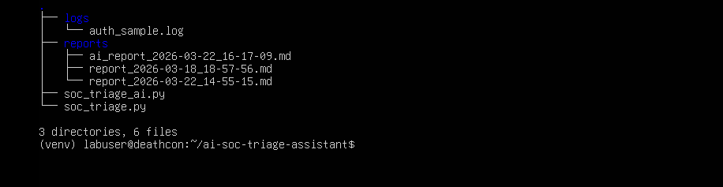
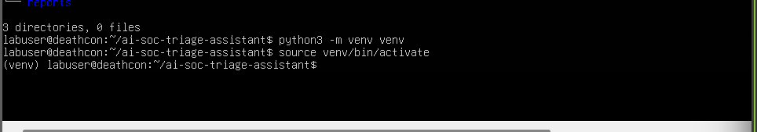
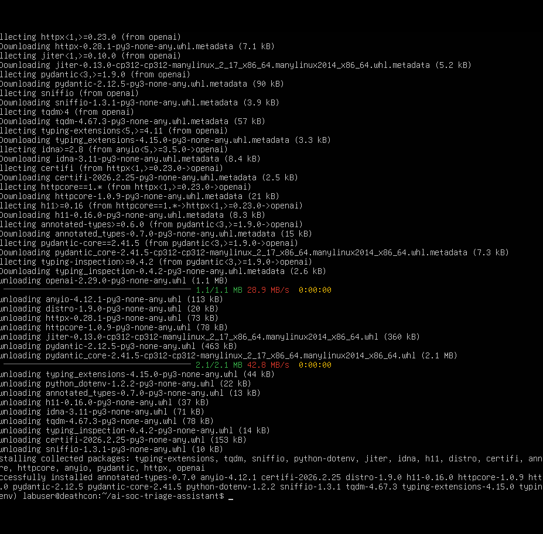
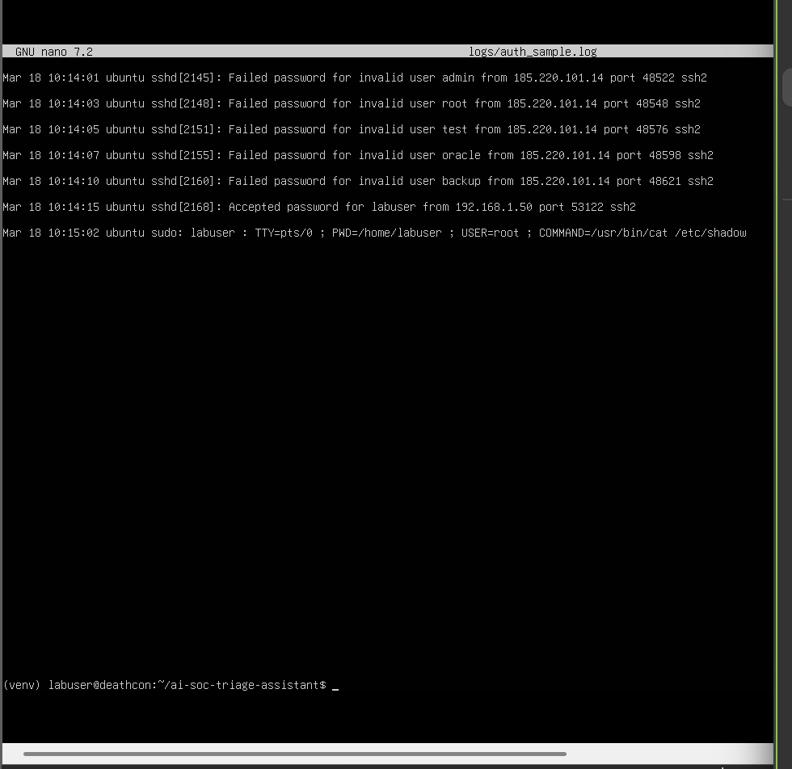
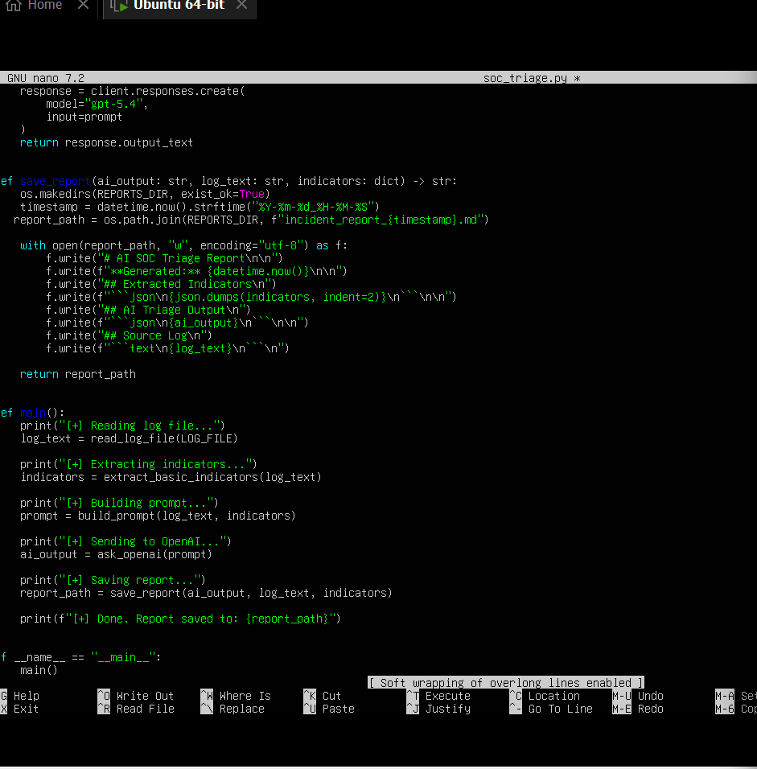
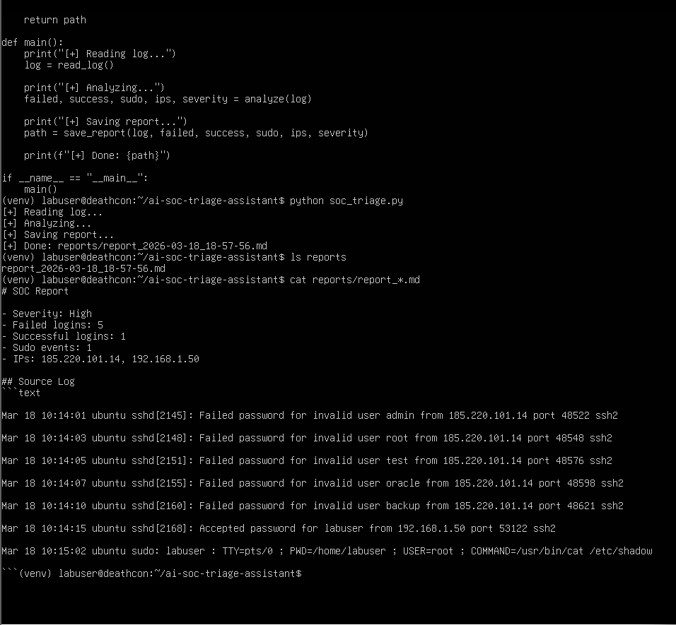
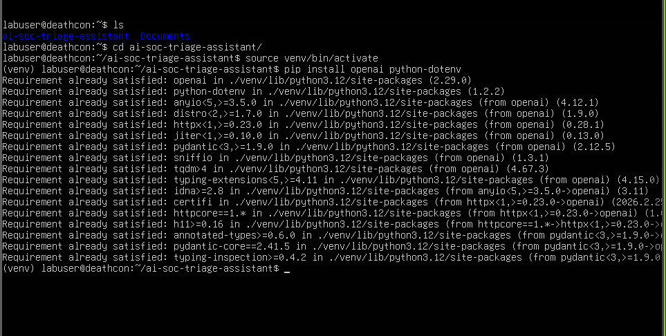
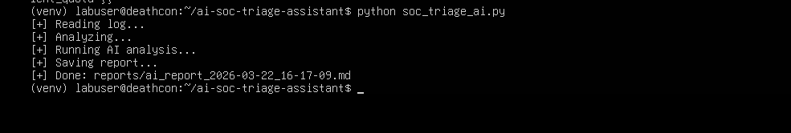
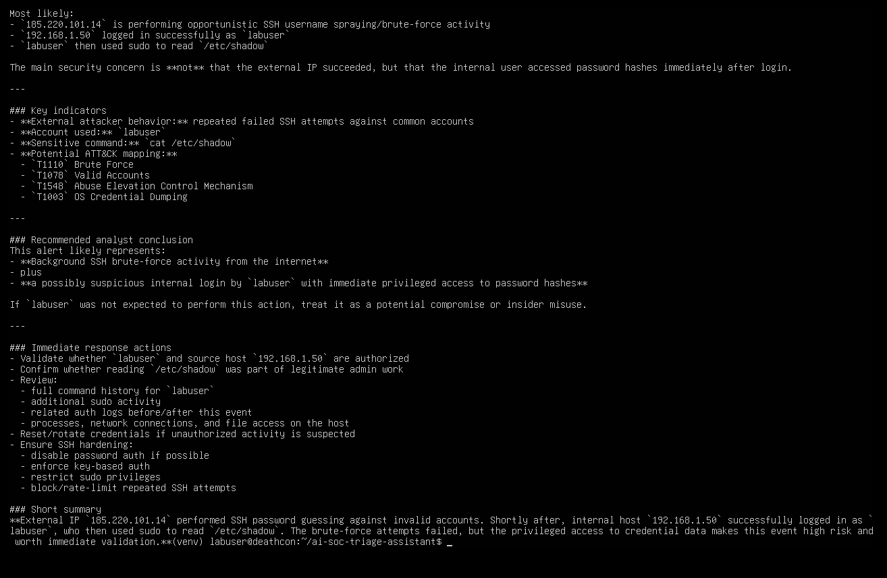

# 🔐 AI-Powered SOC Log Triage & Incident Response (Ubuntu + Python)

## 📌 Overview

This project demonstrates the development of a Security Operations Center (SOC) triage tool built on Ubuntu. The system analyzes Linux authentication logs to detect brute-force login attempts, extract indicators of compromise (IOCs), classify incident severity, and generate structured incident reports.

The project also integrates AI to enhance analysis and simulate real-world SOC workflows.

---

## 🎯 Objectives

* Analyze Linux authentication logs (`auth.log`)
* Detect brute-force login attempts
* Extract indicators of compromise (IP addresses)
* Classify incident severity
* Generate automated incident reports
* Integrate AI for enhanced analysis

---

## 🛠️ Technologies Used

* Ubuntu 24.04 (VMware)
* Python 3
* OpenAI API
* python-dotenv
* Regex
* Linux CLI

---

## 🧱 Project Structure




```
ai-soc-triage-assistant/
├── logs/
├── reports/
├── soc_triage.py
├── soc_triage_ai.py
└── images/
```

---

## ⚙️ Environment Setup

### 🖥️ Virtual Machine Setup




* Configured Ubuntu VM in VMware
* Resolved network connectivity issues (NAT misconfiguration)
* Verified internet access

---

### 📦 Dependency Installation




* Installed Python, pip, and virtual environment
* Installed required libraries: `openai`, `python-dotenv`

---

## 📄 Log Data Preparation




Created a simulated authentication log containing:

* Multiple failed SSH login attempts
* Successful login activity
* Privileged command execution (`sudo`)

---

## 🧠 Rule-Based Detection Script




The rule-based script:

* Parses authentication logs
* Counts failed and successful login attempts
* Extracts IP addresses
* Detects suspicious patterns
* Classifies severity levels

---

## ▶️ Script Execution (Rule-Based)




Results:

* Detected brute-force login behavior
* Classified severity as **High**
* Generated structured incident report

---

## 🤖 AI Integration Setup




* Secured API key using `.env`
* Installed OpenAI SDK and dotenv
* Built AI-enhanced script (`soc_triage_ai.py`)

---

## 🚀 AI-Enhanced Execution




The AI-integrated script successfully:

* Processed authentication log data
* Sent structured analysis to the OpenAI API
* Generated contextual incident analysis
* Provided recommended response actions

---

## 📊 AI-Generated Incident Report

### 🧠 Example Insight
The AI identified a combination of external brute-force attempts and suspicious internal activity involving privileged access, highlighting potential credential misuse or escalation.



The AI-enhanced report includes:

* Severity classification
* Identification of brute-force behavior
* Internal vs external activity analysis
* MITRE ATT&CK technique mapping
* Recommended response actions

---

## ⚠️ Note

All logs, IP addresses, and activity shown in this project are part of a controlled lab environment and do not represent real systems.

---

## 🧠 Key Takeaways

* Built a SOC-style triage workflow from scratch
* Combined rule-based detection with AI analysis
* Simulated real-world log investigation
* Troubleshot networking, Python environment, and API integration issues

---

## 💼 Why This Project Matters

This project demonstrates practical SOC analyst skills including log analysis, threat detection, incident classification, and response planning. It also showcases the integration of AI into security workflows, reflecting modern security operations environments.

---
## 🧩 Key Skills Demonstrated
- Linux system administration
- Log analysis and threat detection
- Python scripting and automation
- Regular expression (regex) parsing
- Incident response and triage
- API integration (OpenAI)
- Secure handling of environment variables
---
## 🚀 Future Improvements

* Real-time log monitoring
* Automated IP blocking
* SIEM integration
* Alert notifications
* Web dashboard

---

## 👩‍💻 Author

Marilyn Bergin
🔗 GitHub: https://github.com/mbergin123
🔗 LinkedIn: https://www.linkedin.com/in/marilyn-bergin/
